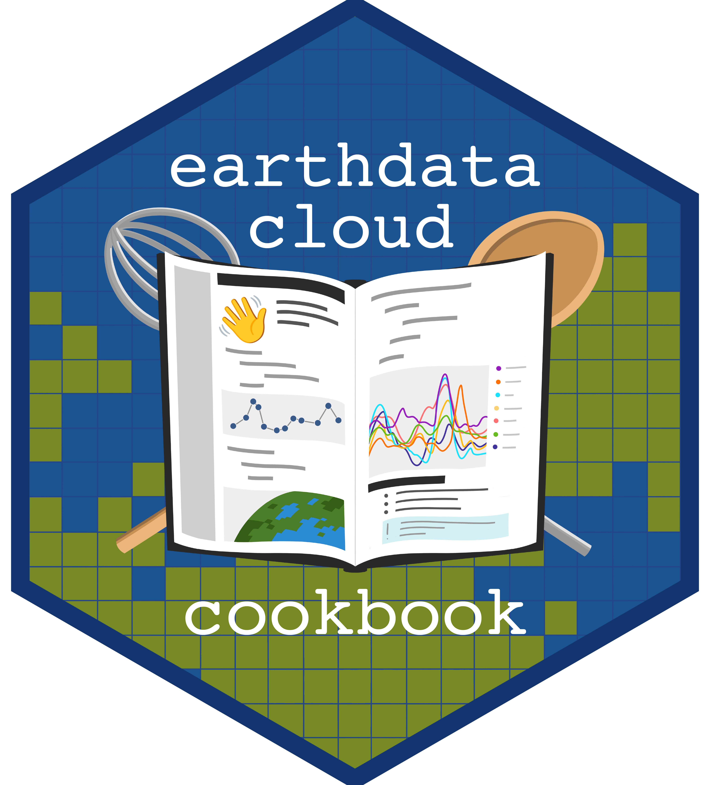

[](https://zenodo.org/record/7786710)

# NASA Earthdata Cloud Cookbook <a href="https://nasa-openscapes.github.io/earthdata-cloud-cookbook/"></a>

**Supporting NASA Earth Science Research Teams' Migration to the Cloud**

The NASA Openscapes Earthdata Cloud Cookbook is a learning resource for
scientific researchers who use NASA Earthdata as NASA migrates data and
workflows to the cloud. It is built as a cross-DAAC collaboration by the
[NASA-Openscapes](https://nasa-openscapes.github.io) team and is under active,
open development.

**Live site:** [nasa-openscapes.github.io/earthdata-cloud-cookbook](https://nasa-openscapes.github.io/earthdata-cloud-cookbook)

---

## What's in the Cookbook

| Section | Description |
|---|---|
| [Our Cookbooks](https://nasa-openscapes.github.io/earthdata-cloud-cookbook/our-cookbooks.html) | Links to DAAC-specific cookbooks (PO.DAAC, NSIDC, ORNL, OB.DAAC, and more) |
| [Core Concepts](https://nasa-openscapes.github.io/earthdata-cloud-cookbook/cloud_paradigm.html) | Conceptual background on cloud computing for Earth science |
| [Tutorials](https://nasa-openscapes.github.io/earthdata-cloud-cookbook/tutorials/) | End-to-end, learn-by-doing workflows (hurricanes, sea level rise, carbon stocks, and more) |
| [How-To Guides](https://nasa-openscapes.github.io/earthdata-cloud-cookbook/how-tos/) | Goal-oriented recipes for finding, accessing, and working with data |
| [Reference](https://nasa-openscapes.github.io/earthdata-cloud-cookbook/appendix/) | Glossary, cheatsheets |

## Quick Start

You can follow along the examples provided on the cookbook or run them locally
download the [corn environment.yml](https://github.com/NASA-Openscapes/corn/blob/main/ci/environment.yml)
from the NASA-Openscapes JupyterHub base image and create a conda environment:

```bash
conda env create -f environment.yml
conda activate nasaopenscapes_env
```

## Key Tools

### Python: earthaccess

The [**earthaccess**](https://earthaccess.readthedocs.io/en/latest/) Python
library streamlines access to NASA Earthdata locally or in the cloud and is
used throughout this Cookbook.

```python
import earthaccess
earthaccess.login()
```

### R: earthdatalogin

The [**earthdatalogin**](https://boettiger-lab.github.io/earthdatalogin/) R package streamlines access to NASA Earthdata from R. While it is not as fully featured as earthaccess, it is the easiest way to authenticate and search for NASA Earthdata from R. As we continue to develop more tutorials in R, they will use this package throughout.

```r
library(earthdatalogin)
edl_netrc()
```

## Contributing

We welcome contributions from the community. See the [Contributing
Guide](https://nasa-openscapes.github.io/earthdata-cloud-cookbook/contributing/)
for setup instructions, workflows, and notebook templates. 

## Citation

Please cite this resource using the Zenodo DOI:
[10.5281/zenodo.7786710](https://doi.org/10.5281/zenodo.7786710). This DOI
always resolves to the latest version.

> Andy Barrett, Chris Battisto, Brandon Bottomley, Aaron Friesz, Alexis
> Hunzinger, Mahsa Jami, Alex Lewandowski, Bri Lind, Luis López, Jack McNelis,
> Cassie Nickles, Catalina Oaida Taglialatela, Celia Ou, Brianna Pagán, Sargent
> Shriver, Amy Steiker, Michele Thornton, Makhan Virdi, Jessica Nicole Welch,
> Jess Welch, Erin Robinson, Julia Stewart Lowndes. (2023).
> NASA-Openscapes/earthdata-cloud-cookbook: NASA EarthData Cloud Cookbook
> v2023.03.0. Zenodo. https://doi.org/10.5281/zenodo.7786711

## License

All materials are publicly available under a [CC-BY license](LICENSE.md),
adapted from [The Turing Way](https://github.com/alan-turing-institute/the-turing-way/blob/master/LICENSE.md).
