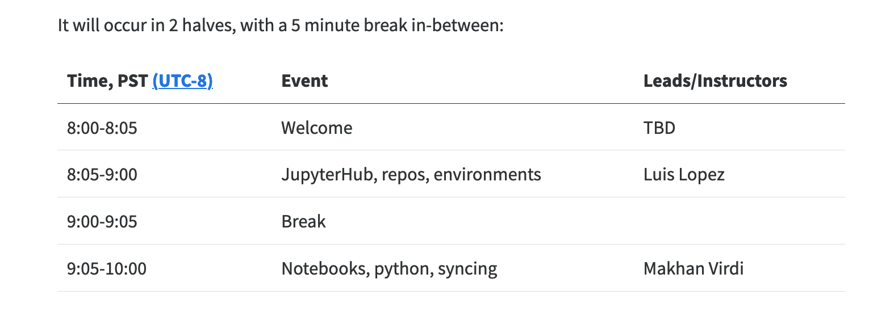

## Workflow for contributing to our Cookbook

Your workflow can be from wherever you are most comfortable. You can
develop chapters working in a text editor, integrated development
environment (IDE), or notebook interface. And you can serve Quarto from
the Command Line or R. Quarto will combine files of different types (
`.md` , `.ipynb`, `.Rmd`, and `.qmd`) to make the Cookbook. This
workflow can streamline collaboration for scientific & technical writing
across programming languages.

By default, rendering the Cookbook will only act on markdown text and
will not execute any code. This way, rendering the whole Cookbook will
not become overly cumbersome as it grows, and there is not one single
virtual environment with all the libraries required. Instead, our
workflow is that as you develop a single chapter (or section), you
control when you render, and can create a `requirements.txt` file for
that chapter (or section). This will also make it much easier to port
lessons that work standalone and are ready for a Cloud instance or a
workshop.

## Quickstart reference

### **Daily setup: get the latest!**

Quarto (and the RStudio IDE if you're using it) are under active
development; currently it's important to get the daily versions before
you start working.

-   Quarto: <https://github.com/quarto-dev/quarto-cli/releases/latest>

-   (RStudio IDE: <https://dailies.rstudio.com/>)

-   Pull from GitHub

    ``` bash
    git checkout main
    git pull
    ```

::: {.callout-tip collapse="true"}
## Summary of GitHub and Quarto commands detailed below

``` bash
## check which branches exist, where you are, and pull recent from main branch
git branch
git checkout main
git pull

## create and switch to new branch
git checkout -b branch-name

## develop content: write prose in markdown, code in R and Python
## remember to render any .ipynb, .rmd, or .qmd files before pushing
quarto serve
quarto render # can also render single file

## commit changes
git add --all
git status
git commit -m "my commit message here"

## push changes
git push -u origin branch-name  # connect your branch to github.com and push

## create a pull request
## from GitHub.com, create a pull request and once it is merged, delete your branch

## delete branch
git checkout main         # switch to the main branch
git pull                  # pull merged updates from github.com
git branch -d branch-name # delete old local  branch
```
:::

## GitHub Workflow

First let's talk about the GitHub part of the workflow.

We will work in branches so as to not overwrite each other's work, and
let GitHub do what it does best.

The `main` branch will be the current approved version of the book. The
main branch is what displays at
<https://nasa-openscapes.github.io/earthdata-cloud-cookbook>.

A nice clean workflow with branches is to consider them temporary. You
pull the most recent from `main`, you create a branch locally, you make
your edits, you commit regularly, you push regularly to github.com, and
then you create a pull request for it to be merged into `main`, and when
it's approved the branch is deleted on github.com and you also delete it
locally. That's the workflow we'll walk through here. A great resource
on GitHub setup and collaboration is [Happy Git with
R](https://happygitwithr.com/), which includes fantastic background
philosophy as well as bash commands for setup, workflows, and
collaboration.

The following assumes you're all [setup](contributing/setup) from the
previous chapter.

### Branch setup

First off, check what branch you're on and pull the most recent edits
from the main branch. If you need to switch branches, use
`git checkout`. \*Note: a new alternative to `git checkout` is
`git switch` (see [this
blog](https://www.banterly.net/2021/07/31/new-in-git-switch-and-restore/));
when you updated git consider using it here instead too.

``` bash
git branch          # returns all local branches
git checkout main   # switch branch to main
git pull            # pull most recent from the main branch
```

If you are already on the `main` branch, git will tell you, and that's
fine.

(If you have any residual branches from before, you'll likely want to
start off by deleting them --- assuming they were temporary and have
been merged into github.com. You can delete a branch with
`git branch -d branch-name`).

Next, create a new branch, then switch to that branch to work in. Below
is a one-step approach for the two-step process of
`git branch branch-name` then `git checkout branch-name` (read
[more](https://git-scm.com/book/en/v2/Git-Branching-Basic-Branching-and-Merging)).

``` bash
git checkout -b branch-name  # create and switch to new branch
```

### Develop content

Time to edit and develop content, and run your Quarto Workflow -- see
[specific instructions below](#develop-cookbook-content). While you're
developing, you'll want to frequently commit and push your changes.

### Commit changes

You'll commit your work regularly as you go, likely using the following,
which commits all files you've affected within the Cookbook project:

``` bash
git add --all
git commit -m "my commit message here"
```

From [R Packages](https://r-pkgs.org/git.html#git-commit) by Hadley
Wickham:

> A commit takes a snapshot of your code at a specified point in time.
> Using a Git commit is like using anchors and other protection when
> climbing. If you're crossing a dangerous rock face you want to make
> sure you've used protection to catch you if you fall. Commits play a
> similar role: if you make a mistake, you can't fall past the previous
> commit.

Here are more of Hadley's suggested [best
practices](https://r-pkgs.org/git.html#commit-best-practices).

::: callout-tip
## You must re-render all files that aren't plain `.md`s to view your edits

If you added or made changes to any text or code (including changing the
dataset upon which existing code relies) within `.ipynb`, `.qmd`, or
`.Rmd` files, you must re-render those files individually before
pushing. See the [Quarto render](#quarto-render) section for more
details. Afterwards, `git add` and `git commit` any changes to the
updated `_freeze` directory before continuing on to the next step.

Local re-rendering is necessary in cases where code is changed because
the [workflow used to make this
site](https://github.com/NASA-Openscapes/earthdata-cloud-cookbook/blob/main/.github/workflows/quarto-render.yml)
assumes that all code has been pre-executed. Read more about this at
[freeze
section](https://quarto.org/docs/books/book-authoring.html?q=freeze#freezing)
at the Quarto docs.
:::

### Push changes

When you're ready to push changes you've made in your branch, you'll
first need to connect it to github.com by pushing it "upstream" to the
"origin repository" (`-u` below is short for `--set-upstream`):

``` bash
git push -u origin branch-name  # connect your branch to github.com and push
```

The above is a one-time command to connect your local branch back to
github.com. After you've pushed successfully the first time, then as you
continue to commit, you'll be able to push as normal:

``` bash
git push
```

### Update local branch with remote main branch

If while you're working you would like to update your local
`your-branch` with the most recent updates on the `main` branch on
GitHub.com, there are several ways to do this.

#### checkouts and merge main

[Git Update Local Branch with remote
Master](https://stackoverflow.com/questions/34656523/git-update-local-branch-with-remote-master)

```{bash}
git checkout main
git pull
git checkout your-branch
git merge main
```

#### fetch and merge origin/main

```{bash}
git checkout your-branch
git fetch
git merge origin/main
```

### Pull Request

Now you've synced your work to github.com. It is currently online, in a
separate branch from the `main` branch. Go to
<https://github.com/nasa-openscapes/earthdata-cloud-cookbook>, find your
branch, and do a pull request.

TODO: Let's discuss our review process:

-   Tag someone to review, (including you if it's a quick fix?)
-   Timeline
-   Merging

When the pull request is merged, delete the branch on github.com. GitHub
will prompt you with a button at the end of the merge.

### Delete Branch

Once your pull request is merged and you've deleted the branch from
github.com, then come back to your local setup and delete the branch
locally:

``` bash
git checkout main         # switch to the main branch
git pull                  # pull merged updates from github.com
git branch -d branch-name # delete old local  branch
```

## Quarto Workflow

Now the fun part! Our overall workflow will be to serve the book at the
beginning, develop/edit chapters as simple text files
(`.md`/`.qmd`/`.Rmd`) or executable notebooks (`.ipynb`) that will all
render into the book.

Quarto lets us easily convert between file types, so depending on how
you prefer to work and how you'd like to interact with different
audiences, we can go between formats as we wish. For example, we can
converting an existing `.ipynb` to `.qmd` to collaborate during
development, and then convert back to `.ipynb` files for our workshops.
See `quarto convert help` for details.

As you work, you'll follow our GitHub workflow above, committing
regularly. Remember to `quarto render` individual notebooks you're
working on so that your changes will be be included in the whole
Cookbook before pushing to github.com.

The following is to run Quarto from the command line; see
[quarto.org](https://quarto.org/docs/getting-started/quarto-basics.html)
to see equivalents in R.

### Quarto serve

The thing to do first is to "serve" the Cookbook so that we can see what
it looks like as we develop the chapters (it's called "serve" because
it's really a website that looks like a book).

Run the following from your branch in your `earthdata-cloud-cookbook`
directory from the command line:

``` bash
quarto serve
```

And after it's is served, you can click from the console (or paste the
url into your browser) to see the development version of the Cookbook.

::: callout-tip
## This command line instance is now being used to serve Quarto

You can open another instance to continue working from the command line,
including running other shell commands and rendering (see next).
Launching your command line shell of choice will open a new instance.
:::

### Develop Cookbook Content {#develop-cookbook-content}

You can develop Cookbook chapters in the text editor, IDE, or notebook
editor of your choice (i.e. see [JupyterLab with
Quarto](https://quarto.org/docs/tools/jupyter-lab.html)).

#### RStudio IDE & Visual Editor

You can also use the RStudio IDE. It can be used as a simple text
editor, but it can also interactively execute code in `.qmd` and `.Rmd`
files too.

The RStudio IDE Visual Editor makes this experience feel like a cross
between an interactive notebook and a Google Doc:


Above shows the Visual Editor in the top left pane with an interactive
`.qmd` file. Learn more about the [RStudio Visual
Editor](https://quarto.org/docs/tools/rstudio.html).

Another benefit of the RStudio IDE is that it has a docked command line
(Terminal, bottom left pane), file navigation (bottom right pane) and
GitHub interface (top right pane). The IDE helps keep things organized
as you work, and provides a visual way to review your git commits and do
common commands (see this RStudio-GitHub walk through from [R for Excel
Users](https://rstudio-conf-2020.github.io/r-for-excel/github.html#sync-from-rstudio-local-to-github-remote)).
Note too that the image shows the second instance of the Terminal
command line; the first is being used to serve Quarto.

### Quarto render {#quarto-render}

As you develop book chapters and edit files, any `.md` files will
automatically refresh in the browser (so long as quarto serve is
running)!

To refresh files with executable code, you'll need to render them
individually. You can do the following to render `.ipynb`/`.qmd`/`.Rmd`
files so that they show up refreshed in the served Cookbook.

``` bash
quarto render my-document.ipynb      ## render a notebook
quarto render my-work.qmd            ## render a Quarto file
quarto render my-contribution.Rmd    ## render a RMarkdown file
```

From the RStudio IDE, you can also press the **Render** button to render
`.qmd` and `.Rmd` files.

And you can also render the whole book:

``` bash
quarto render
```

Learn more about [rendering with
Quarto](https://quarto.org/docs/computations/running-code.html#rendering).
From J.J. Allaire:

> The reason Quarto doesn't render `.Rmd` and `.qmd` on save is that
> render could (potentially) be very long running and that cost
> shouldn't be imposed on you whenever you save. Here we are talking
> about the age old debate of whether computational markdown should be
> rendered on save when running a development server. Quarto currently
> doesn't do this to give the user a choice between an expensive render
> and a cheap save.

### Includes (re-use markdown)

We are setup with an **includes filter** (details at [Quarto.org](https://quarto.org/docs/authoring/shortcodes-and-filters.html#includes)) that lets us re-use markdown content within a project! (You can think of this like "knit child" in R Markdown and lets you source text like you source scripts from each other). This means that we can write text more modularly and re-use it in multiple places so that it's always up to date. 

An example of this in action is in our [2021-Cloud-Hackathon](https://nasa-openscapes.github.io/2021-Cloud-Hackathon/logistics/schedule.html) Quarto book, where each day of the [schedule](https://nasa-openscapes.github.io/2021-Cloud-Hackathon/logistics/schedule.html) is saved in a separate file:


<br>

This is then called within a book chapter, with a relative filepath:


```
The Clinic will occur in 2 halves, with a 5 minute break in-between:

{.include}
../logistics/_schedule-clinic.md
```


...to finally look like so: 




**Includes - things to note**

- prefix files to include with an underscore. 
  - From [quarto.org](https://quarto.org/docs/authoring/shortcodes-and-filters.html#includes): You should always use an underscore prefix with included files so that they are automatically ignored (i.e. not treated as standalone files) by a `quarto render` of your project.

## 2i2c Workflow

We use [2i2c](https://2i2c.org/) to run notebooks.

### Log into 2i2c

1.  Go to the [openscapes
    2i2c](https://openscapes.2i2c.cloud/hub/login?next=%2Fhub%2F). *You
    should see the openscapes 2i2c instance.*
2.  Click on the orange "Log in to continue" button. *You should see the
    Openscapes-Prod page.*
3.  Click the "Sign in with Github" button and log in. *If you aren't
    already logged into Github, you should see the login prompt.
    Otherwise, you will be logged in automatically.*

### Start a 2i2c session

At this point, what you see depends on whether or not you have an active
session. If your session is active, JupyterLab will load and you can
start your work. If not, you'll need to start a new session:

1.  Select a server based on the size of your job. *You should see a
    progress window showing you what 2i2c is doing to get your session
    started. It may take several minutes, but you'll eventually see a
    JupyterLab instance.*

### Create a Jupyter kernel to run notebooks

The default jupyter kernel may not have all the libraries you need to
run a notebook. Fortunately, you can make a new kernel on the fly to use
with the notebook.

1.  Open a terminal in JupyterLab.

    1.  Click on the large blue "+" button on the upper left. *You
        should get a new Laucher tab.*
    2.  In the Launcher tab, click on "Terminal" under "Other." *You
        should get a tab with a command line prompt.*

2.  Create a conda environment using your [favorite
    method](https://conda.io/projects/conda/en/latest/user-guide/tasks/manage-environments.html).

3.  Activate the new environment with
    `conda activate YOUR_ENVIRONMENT_HERE`. *You should see the name of
    the new environment in your command line prompt.*

4.  Create a new kernel by calling
    `ipython kernel install --name YOUR_ENVIRONMENT_HERE --user`. *You
    should get a response saying saying the kernel has been installed.*

To use this new kernel,

1.  Open the notebook you want to run. *You should see the notebook in a
    tab.*
2.  Click on the current kernel on the upper right. The default kernel
    is called `Python 3`. *You should see a kernel selection widget.*
3.  Select the new kernel you created and click the "Select" button.
    *The kernel on the upper right should now give the name of your
    custom kernel.*

## Virtual Environments

If you are working on a chapter that loads any Python or R packages, to
make your work reproducible you'll need to create and then update the
`environments.txt` file. Do this use the `pip freeze` command:

``` bash
pip freeze > requirements.txt
```

This will overwrite/update the `requirements.txt` file. Depending on
where you are working, you might also want to create a new subfolder to
store the `requirements.txt`. See the next section on Cookbook
Structure.

You you will then commit and push along with your other edits back to
github.com.

TODO: info about conda...

## Cookbook Structure

Each chapter in our Cookbook is a separate file (`.md`/
`.ipynb`/`.qmd`/`.Rmd`). These are stored in our `files` directory,
organized by sub-directory.

The Cookbook structure (i.e. the order of sections and chapters) is
determined in the `_quarto.yml` file in the root directory. We can
shuffle chapter order by editing the `_quarto.yml` file, and and add new
chapters by adding to the `_quarto.yml` and creating a new file in the
appropriate sub-directory that is indicated in `_quarto.yml`.


Please experiment, add new chapters and sections; we can shuffle chapter
order and subsections as we continue to develop the Cookbook, nothing is
set in stone.

## Cookbook Practices

These are shared practices that we have for co-developing the Cookbook.
This will be developed further as we go!

### Executing notebooks

As you develop files with executable code ( `.qmd`, `.Rmd`, and
`.ipynb`), you can decide if you don't want the notebook to execute. By
adding YAML as a raw text cell at the top of an `.ipynb` file, you can
control whether it is executed or not. Adding `execute: false` to the
YAML at the top of the file basically means that Quarto never runs the
code, but the user of course still can interactively in Jupyter.

Using `.qmd` there are also ways to control execution cell-by-cell via
`# |` syntax within a code chunk; see
<https://quarto.org/docs/computations/execution-options.html>

### Including remote notebooks

We can include remote notebooks in the Cookbook by explicitly importing
them with the following steps. This will create a local copy of them
that have additional preamble inserted that includes the original urls
and attribution for the notebook.

1.  Navigate to the `_import` directory.

2.  Open `assets.json` in a text editor. Copy an existing example and
    use the same structure to indicate the remote notebook you'd like to
    include. You can write Markdown in the preamble.

    1.  title: this will be the new title of the notebook

    2.  preamble: this text will be inserted into the notebook below the
        new title. It should include any description and attribution of
        the notebook. The preamble is followed by two URL fields (next):

    3.  source: the url landing page. This should be more general than
        the specific notebook (i.e. this could be the root GitHub
        repository).

    4.  url: the url of the notebook. (i.e. a url that ends with
        .`ipynb`)

    5.  target: the local filename to give the notebook. The notebook
        will be saved in the `external` folder in the root directory.

    6.  process: true or false: whether or not to include the entire
        entry when running the `quarto_import.py` script

After these updates to `_import/assets.json`, to the following in the
terminal:

```{.bash}
cd _import
conda env update -f environment.yml
conda activate quarto-import
python quarto_import.py -f assets.json
```

This will return a confirmation of the file that has been processed.

Then update `_quarto.yml` by adding your file (`external/<target`) to
the appropriate location in the Cookbook.

### Create a .qmd from external .ipynb

This is a bit of a hacky way that we can formalize further if it's useful: 

1. Go to an existing notebook, e.g. <https://github.com/podaac/AGU-2020/blob/main/Part-II/01_sst_shpfile/AGU_tutorial1_shp_search.ipynb>
1. Click on Raw, e.g. <https://raw.githubusercontent.com/podaac/AGU-2020/main/Part-II/01_sst_shpfile/AGU_tutorial1_shp_search.ipynb>
1. Copy text
1. In your local setup (e.g. RStudio IDE): New File > Text File > Paste > Save (with the same name if appropriate) and `.ipynb` extension, e.g.: `discovery/search-by-shapefile.ipynb`
1. In the command line: 

```{.bash}
#| eval: false
quarto convert help # reminder of commands!
quarto convert discovery/search-by-shapefile.ipynb # convert to .qmd
rm discovery/search-by-shapefile.ipynb # delete .ipynb
```

## Notebook Review

### Preamble

GitHub displays differences in code, so a nice way to review other people's work (or your own) is to edit files directly and view the commit differences  at GitHub. We'll do this by first creating a branch and pull request so that that there is a chance for the original author to be notified of the suggestions and review them before merging back to the main branch (at which point the quarto book/site will be rebuilt since we have a GitHub action setup to do so). 

GitHub can have trouble with `.ipynb` notebooks; their differences include file-formatting changes and are often too big to display. See examples: [CMR notebook](https://github.com/NASA-Openscapes/2021-Cloud-Hackathon/pull/13/files#diff-04b62f1a27203bba0cb44a2a0360a3c68e19b2199dd4e3c96a59156b5d253884) with file-formatting diffs and the [CMR-STAC API notebook review](https://github.com/NASA-Openscapes/2021-Cloud-Hackathon/pull/18/files#diff-4bd08e3e686fffae6339ffad77be5ad50879704bdf57f0505f11dbffeb43e0d3) with diffs too big to display. This means that while you can still edit it directly, it's hard to alert the author to what changes you made. Some emerging conventions to help with this: 

- write `TODO` for "to do's", but this as one word all-caps makes it easier to search

### Review with .qmds

Since quarto notebook files (`.qmd`s) are text files, GitHub can display their differences nicely, for  example: [CMR-STAC API qmd](https://github.com/NASA-Openscapes/2021-Cloud-Hackathon/pull/18/commits/755a17abec3d9b18d1b8b12bf951455fec351213#diff-753f51abfb9f0a881920f172502191350a37d651f89d29e04b1e1e563a1e07af). 

Here is a workflow to leverage `.qmd`s in our review process: 

1. Clone/pull the repo, create a branch following our [GitHub Workflow](#github-workflow) above
1. In the terminal, use `quarto convert` to convert a notebook from `.ipynb` to `.qmd`. You'll have to either `cd` into the folder or you can convert by specifying the filepath. Typing `quarto convert help` will describe more options. 

```{bash}
| eval: false
## git clone and branch
git clone https://github.com/NASA-Openscapes/2021-Cloud-Hackathon/
git checkout -b my-new-branch

## quarto convert
quarto convert tutorials/Data_Discovery__CMR-STAC_API.ipynb
```

This creates `tutorials/Data_Discovery__CMR-STAC_API.qmd`. 

Commit this so that the whole file is tracked and any changes you make will be viewed as diffs. Follow the [GitHub Workflow](#github-workflow) above. 

Now, make edits/review the `.qmd` in your editor of choice, which will likely also have spell-check and markdown support.

At the moment, this is best with making edits to the `.qmd` locally while ALSO running the `.ipynb` notebook in 2i2c. This will iterate as we get quarto set up in 2i2c (and as we work more with `.qmd`s). 

When you're done with your review, you will want to push not only your edited `.qmd`, but also a `.ipynb` with all your changes. This way, the notebook author can both easily see the diffs made to the `.qmd`, and run the `.ipynb` as they normally would. To do so: 

```{bash}
#| eval: false
quarto convert tutorials/Data_Discovery__CMR-STAC_API.qmd 
```

This will create `tutorials/Data_Discovery__CMR-STAC_API.ipynb`, and over-write the original with your changes.

**Note**: Quarto will consider the `.qmd` book chapter and try to render it. To avoid this, by hand you can prefix the filename with an underscore: before you push: `_Data_Discovery__CMR-STAC_API.qmd`

Now, commit and push your review!

## Code Review

Upcoming.

## Troubleshooting

### Error: AddrInUse

`ERROR: AddrInUse: Address already in use (os error 48)`

This error is because you had more than one instance of `quarto serve`
going in your session. So close other command line instances that are
running and try again. (If you use the R package and do `quarto_serve()`
it will automatically make sure you only ever have 1 instance.)

### Leave/exit a virtual environment

In your Command Line Shell, if you want to leave your virtual
environment, the command is:

```{.bash}
deactivate
```

The way you tell that you are in a virtual environment: it's named in
parentheses at the beginning of your prompt:

```{.bash}
(.venv) (base) JLos-Macbook-Pro:earthdata-cloud-cookbook lowndes$ deactivate
(base) JLos-Macbook-Pro:earthdata-cloud-cookbook lowndes$
```
