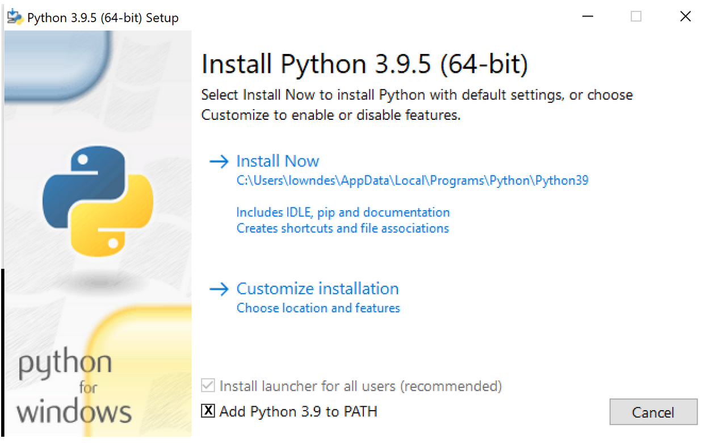

## Overview

This will walk you through the setup required to run Quarto to contribute to our book. You can always refer to [quarto.org](https://quarto.org) for the most up-to-date and more detailed information. 

Setup for our Cookbook is complete when you can answer yes to the following:

- "Can you run Jupyter"? 
- "Can you install Quarto and render a hello world doc"?
- "Can you restore the virtual environment and render our Cookbook?"

The Jupyter and Quarto questions can be answered in any order, but must preceed working with our Cookbook. 

:::{.callout-note}
The following is written for the command line, and we can update with other scenarios as we go.
:::

:::{.callout-note}
The current set-up is for our book that has only Python, not R code. We'll add R setup instructions after we have everyone working with our current setup.
:::

:::{.callout-note}
Coming up we'll also outline other ways to contribute and review the Cookbook through GitHub on the browser. 
:::

## Jupyter

First, install Jupyter (learn more at [jupyter.org/install](https://jupyter.org/install)). 

```{bash}
pip install jupyter
```

Check to make sure it installed properly, launch jupyterlab, which will open in your browser:

```{bash}
jupyter-lab
```

If you need to first install Python, please do so from [python.org/downloads](https://www.python.org/downloads), not from a conda installation. 

**Windows Users:** Please ensure you are using Python from [python.org/downloads](https://www.python.org/downloads) and add to PATH as showed below.



## Quarto

Download the Quarto command line interface (CLI) for your operating system and install following the prompts:

<https://github.com/quarto-dev/quarto-cli/releases/latest>

Check to make sure Quarto installed properly with the following. It should return information about Quarto's commands.

```{bash}
quarto help
```

## Clone the Cookbook from GitHub

Now clone our book:

```{bash}
git clone https://github.com/NASA-Openscapes/earthdata-cloud-cookbook 
cd earthdata-cloud-cookbook
```

If you need to set up GitHub see instructions [TODO]

## Virtual environment

You'll now  need to activate and install the virtual environment that has all the Python (and soon, R) libraries that are required for our Cookbook. See <https://quarto.org/docs/getting-started/installation.html#virtual-environments> for more background on the following steps.

**Activation** differs slightly depending on which platform / shell you are using:

::: {.panel-tabset}
## Bash/Zsh

``` {.bash}
source .venv/bin/activate
```

## Windows

``` {.bash}
.venv\Scripts\activate.bat
```

## PowerShell

``` {.bash}
.venv\Scripts\Activate.ps1
```

Note that you may receive an error about running scripts being disabled when activating within PowerShell. If you get this error then execute the following command:

``` {.bash}
Set-ExecutionPolicy -ExecutionPolicy Unrestricted -Scope CurrentUser
```
:::

**Installation** is done with pip from the requirements.txt file:

```{bash}
pip install -r requirements.txt
```

Sidenote: More details about environments, from [A Guide to Python's Virtual Environments](https://towardsdatascience.com/virtual-environments-104c62d48c54) (Sarmiento 2019):

> A virtual environment is a Python tool for **dependency management** and **project** **isolation**. They allow Python **site packages** (third party libraries) to be installed locally in an isolateddirectory for a particular project, as opposed to being installed globally (i.e. as part of a system-wide Python).


## You're all set! 

Now move on to the workflow chapter. 


