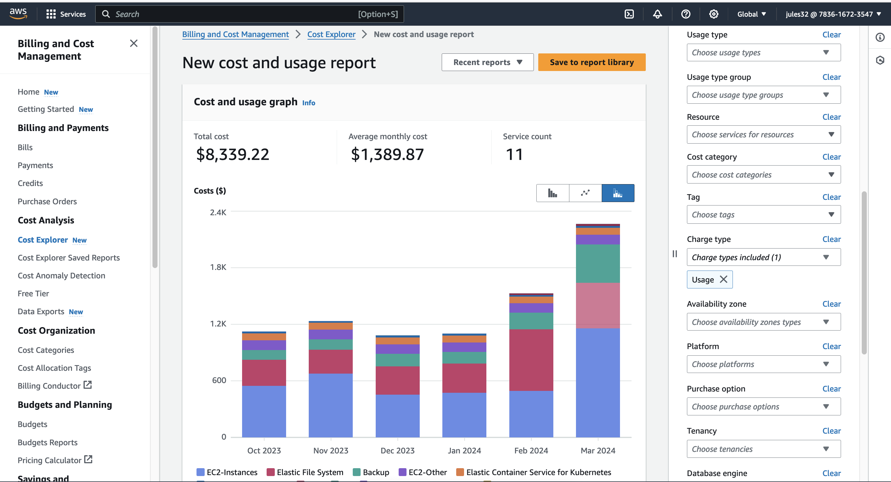
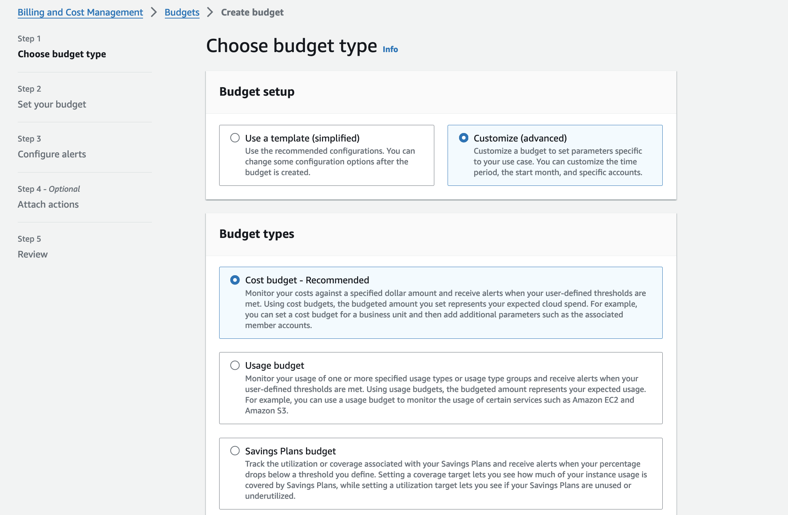
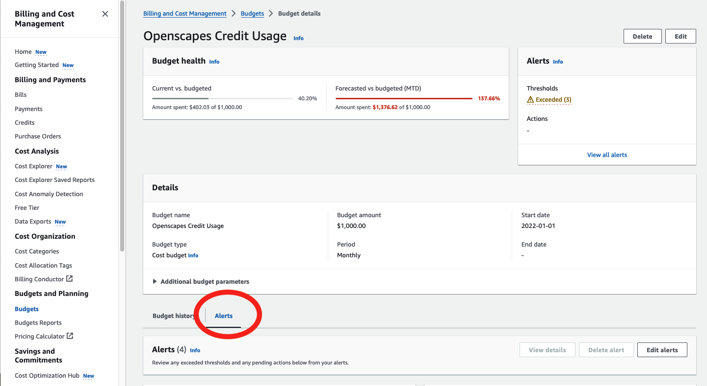

## NASA Openscapes Policies

Our current access policies are found here: <https://github.com/NASA-Openscapes/2i2cAccessPolicies>

## AWS Cost Explorer

*This is a work in progress, currently with minimal steps and screenshots that we will augment.*

AWS Cost Explorer lets you examine how much your usage costs. When using Credits, your usage does not immediately show up. Select Charge type as "Usage" from the right menu.

{fig-align="center" width="437"}

## AWS Budgeting Alerts

*This is a work in progress, currently with minimal steps and screenshots that we will augment.*

There are two types of alerts we set up.

### Budgeting alerts

When adding new Cloud credits to our AWS account, we also create a budget and alerts (received via email) as we spend our credits. These are some beginning notes (credit and thank you to Joe Kennedy!).

Create an annual budget of the total Credits left (you may need to calculate this if credits rolled over at the beginning of the calendar year). In the Budget menu, create a Budget. Then select Customize and Cost budget.

{fig-align="center" width="394"}

We set these up at 50, 75, 90, 95% of the total budget, and we will receive emails at those percentages. The thinking is that we will need to request more credits starting at 50-75%, and then make sure we have them in hand by 90-95%.

### Threshold alerts

We can also set up email alerts at certain dollar amounts.

{fig-align="center" width="426"}

We receive emails when we spend \$100, \$200, \$500 of our Credits, which show up in the system as \$1000 intervals.
